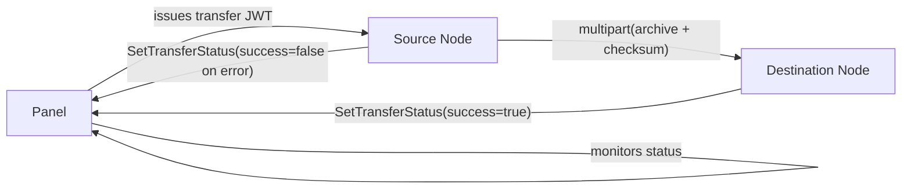
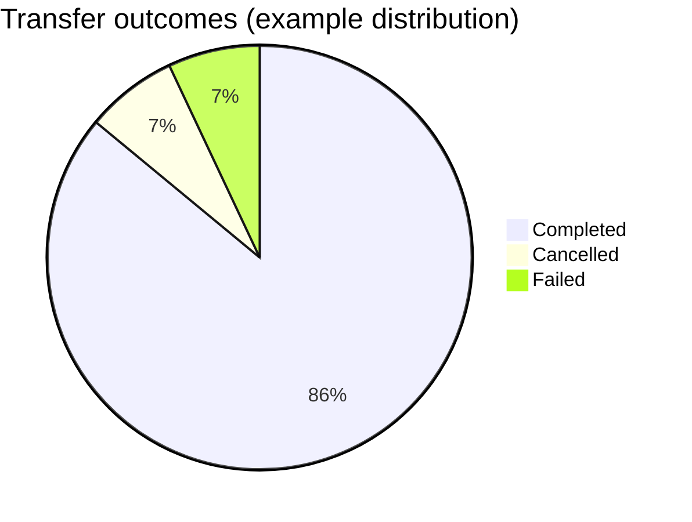

## Server Transfers

This document explains how server transfers work in FeatherWings, including the source and destination flows, configuration, endpoints, tokens, and example requests. It also includes sequence and flow diagrams to visualize the process.

### Overview

- The source node streams a compressed archive of a server's data to the destination node over HTTP multipart form-data.
- Integrity is ensured with a SHA-256 checksum validated by the destination.
- The destination creates or attaches a server instance, extracts files, configures the environment, and reports success to the Panel. The source only reports failures.

### Prerequisites

- A valid transfer JWT issued by the Panel with subject set to the destination server UUID.
- Destination node reachable at its `POST /api/transfers` endpoint via HTTPS.
- Source node has permission to initiate transfer via `POST /api/servers/:id/transfer`.

### Configuration

- `config.yml` relevant keys:
  - `api.ssl.enabled`: enable TLS on the node API.
  - `transfers.download_limit`: limit incoming transfer bandwidth (0 = unlimited).
  - `transfers.perform_checksum_checks`: **enable SHA-256 checksum validation on incoming transfers** (default: `false`).
  - `allowed_origins`: ensure Panel/UI origins are allowed for websockets and CORS, e.g.
    - `- https://featherpanel.mythical.systems`

### High-level architecture



### Sequence of operations

```mermaid
sequenceDiagram
  participant Panel
  participant Source
  participant Destination

  Panel->>Panel: Create transfer JWT (sub = destination server UUID)
  Panel->>Source: POST /api/servers/:id/transfer { url, token="Bearer <jwt>" }
  Source->>Source: Stop server container; mark transferring
  Source->>Destination: POST /api/transfers (multipart: archive, checksum) with Authorization: Bearer <jwt>
  Destination->>Destination: installer.New() -> create/attach server; mark transferring
  Destination->>Destination: Extract archive into server directory; verify SHA-256 checksum
  Destination->>Destination: CreateEnvironment(); successful=true
  Destination->>Panel: SetTransferStatus(uuid, successful=true)
  Source-->>Panel: Only report failures (successful=false)
```

### Endpoints

| Role | Endpoint | Method | Purpose |
|---|---|---|---|
| Source | `/api/servers/:id/transfer` | POST | Initiate transfer to destination URL with JWT |
| Source | `/api/servers/:id/transfer` | DELETE | Cancel outgoing transfer |
| Destination | `/api/transfers` | POST | Receive archive stream and checksum, perform install/extract |
| Destination | `/api/transfers` | DELETE | Cancel incoming transfer |

### Request contract

- Source initiation payload:

```json
{
  "url": "https://DEST_NODE/api/transfers",
  "token": "Bearer <transfer_jwt_from_panel>",
  "server": { "uuid": "<server_uuid>" }
}
```

- Destination expects HTTP header `Authorization: Bearer <transfer_jwt>` and multipart form parts:
  - `archive`: binary stream of tar.gz data (required)
  - `checksum`: hex-encoded SHA-256 of the `archive` payload (required **only if** `transfers.perform_checksum_checks` is `true`; ignored otherwise)

### cURL examples

- Initiate transfer from Source:

```bash
curl -X POST \
  -H "Authorization: Bearer <panel-api-token>" \
  -H "Content-Type: application/json" \
  https://SOURCE_NODE/api/servers/<server_id>/transfer \
  -d '{
    "url": "https://DEST_NODE/api/transfers",
    "token": "Bearer <transfer_jwt_from_panel>",
    "server": { "uuid": "<server_uuid>" }
  }'
```

- Cancel outgoing (Source):

```bash
curl -X DELETE \
  -H "Authorization: Bearer <panel-api-token>" \
  https://SOURCE_NODE/api/servers/<server_id>/transfer
```

- Cancel incoming (Destination):

```bash
curl -X DELETE \
  -H "Authorization: Bearer <panel-api-token>" \
  https://DEST_NODE/api/transfers
```

### Operational considerations

- Source stops the server container before archiving to maintain consistency.
- Destination verifies checksum after extraction when `transfers.perform_checksum_checks` is enabled; mismatch aborts the transfer.
- Progress is emitted via server events for UI consumption.
- Only the destination reports success to the Panel; the source reports failure conditions.
- Ensure the `token` field you pass from the source includes the `Bearer ` prefix so the destination parser accepts it.

### Simple status visualization (example)



### Implementation references (source code)

- Router endpoints: `router/router.go`, `router/router_server_transfer.go`, `router/router_transfer.go`
- Transfer internals: `server/transfer/*` (archive streaming, managers, source push)
- Panel client: `remote/http.go` (`SetTransferStatus`)


